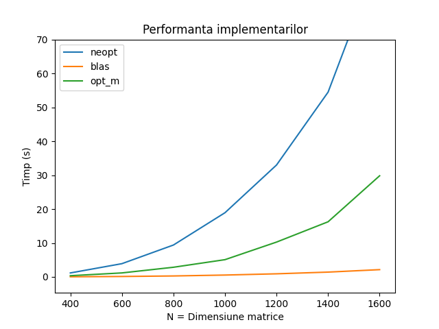

# Tema 2 - Optimizarea inmultirilor de matrice
_Stanca Adelin-Nicolae 331CA_

Pentru efectuarea temei am incercat sa realizez intr-un mod cat mai optim un set
de operatii asociate matricelor patratice. Calculul din cerinta temei `C = B * A * A + B' * B'`
a trebuit implementat in 3 cazuri: varianta neoptimizata (care se reduce practic
la cateva parcurgeri de matrice clasice care presupun o complexitate de
**O(N^3)**), dupa care am inceput operatiile de optimizare a acestor inmultiri,
tinand cont de faptul ca `A` este o matrice superior triunghiulara, dupa care in
ultima varianta am folosit biblioteca blas construita specific pentru acest gen
de operatii, rezultatul fiind considerabil mai mare.

## Varianta neopt
In cadrul acestei implementari, am folosit 3 matrice auxiliare pentru a stoca
rezultatele celor 3 inmultiri de matrice pe care le-am realizat in functia de solver.
Dat fiind ca este o versiune neoptimizata, parcurgerea se realizeaza in ordinea
i-j-k, tinand cont doar de faptul ca A este matrice superior triunghiulara, fapt
pentru care k nu va merge de la 0 la N, ci de la/pana la j in functie de matricea
in cauza (cea originala sau cea transpusa). Am observat din analiza fisierelor
.cache obtinute ca exista un numar semnificativ mai ridicat de refs in acest context,
atat pe partea de date cand si pe cea de instructiuni, fapt intuit de timpul mai
incet de executie. Rezultatele rularii acestui algoritm sunt urmatoarele:
```
Run=./tema2_neopt: N=400: Time=1.166271
Run=./tema2_neopt: N=600: Time=3.901524
Run=./tema2_neopt: N=800: Time=9.399700
Run=./tema2_neopt: N=1000: Time=18.924545
Run=./tema2_neopt: N=1200: Time=32.991879
Run=./tema2_neopt: N=1400: Time=54.475552
Run=./tema2_neopt: N=1600: Time=94.610786
```
## Varianta opt_m
Pentru a eficientiza viteza de executie a algoritmului de la varianta anterioara,
am decis sa aplic modificarile recomandate in laboratorul 5, plus alte cateva idei:
### Cresterea eficientei spatiale
Pentru a eficientiza complexitatea spatiala, am decis ca in cazul operatiilor cu
matricea transpusa sa nu mai aloc spatiu separat pentru constructia sa, ci doar
sa realizez o parcurgere pe coloana in loc de linii (sau invers) in situatia in
care matricea era implicata intr-o operatie de inmultire sau adunare.

### Eliminarea constantelor din bucle
Pentru a evita calculul unor indecsi ce necesita inmultiri, cum ar fi `i * N + j`,
am decis sa folosesc pointeri al caror rol este acela de a fi incrementati
periodic, la fiecare element al sumei sau pentru fiecare pozitie. Aceasta
optimizare scade numarul final de operatii si ajuta CPU-ul sa finalizeze mai
rapid calculele. Am incercat sa aplic aceasta procedura pentru fiecare bucla,
insa am avut cateva dificultati pentru matricele transpuse, precum si in cazul
matricelor superior triunghiulare, unde trebuia sa am grija exact de unde incepe
parcurgerea pentru a evita inmultiri inutile cu 0.


### Folosirea register <tip de date>
Pentru a eficientiza accesul la memorie, am folosit variabile de tip register
care m-au ajutat sa elimin aceste overhead-uri inutile prin retinerea
variabilelor direct in registrele CPU-ului.


Executia acestei variante a adus urmatorii timpi:
```
Run=./tema2_opt_m: N=400: Time=0.352168
Run=./tema2_opt_m: N=600: Time=1.173189
Run=./tema2_opt_m: N=800: Time=2.842671
Run=./tema2_opt_m: N=1000: Time=5.082324
Run=./tema2_opt_m: N=1200: Time=10.267430
Run=./tema2_opt_m: N=1400: Time=16.251318
Run=./tema2_opt_m: N=1600: Time=29.819313
```
Dupa analiza fisierelor .memory si .cache, se poate concluziona ca a scazut
numarul total de refs fata de varianta neoptimizata (atat pentru data, cat si
pentru instruction), insa numarul de miss-uri a ramas aproximativ acelasi.
## Varianta blas
Pentru a folosi aceasta biblioteca, am decis sa folosesc 2 functii de real
ajutor: **cblas_dtrmm** (care efectueaza inmultiri de matrice si transpunere,
permitand prin prezenta unui parametru si evidentierea faptului ca una dintre
matrice este superior triunghiulara), precum si functia **cblas_dgemm** pe care
am folosit-o in principal pentru adunarea celor 2 rezultate preliminare. Dupa
ce am copiat in variabila C valoarea matricei B, am folosit **cblas_dtrmm**
pentru a calcula `B * A`, dupa care am folosit practic aceeasi functie cu o
mica schimbare pentru a genera `B * A * A'`. La final, am folosit **cblas_dgemm**
pentru a aduna la acest rezultat initial si inmultirea dintre `B'` si `B`.
Rezultatele rularii acestei versiuni sunt urmatoarele:
```
Run=./tema2_blas: N=400: Time=0.037766
Run=./tema2_blas: N=600: Time=0.124773
Run=./tema2_blas: N=800: Time=0.277509
Run=./tema2_blas: N=1000: Time=0.544690
Run=./tema2_blas: N=1200: Time=0.913739
Run=./tema2_blas: N=1400: Time=1.414041
Run=./tema2_blas: N=1600: Time=2.139851
```
Scaderea timpilor de executie este extrem de vizibila, precum si scaderea
numarului de refs fata de versiunile precedente, fapt ca indica eficienta
metodelor acestei biblioteci.

## Comparatia la nivel grafic
Graficul care indica evolutia celor 3 variante este urmatorul:



Se poate observa ca metoda folosirii bibliotecii **blas** este de departe cea
mai eficienta, functia de crestere a timpului raportat la N fiind una liniara
cu o panta foarte mica, comparativ ce celelalte 2 implementari ce par a avea o
crestere mai degraba exponentiala (in fapt, este una polinomiala). In fapt,
metoda blas pare sa fie de 11-13 ori mai rapida decat varianta optimizata si de
pana la aproximativ 40 de ori mai rapida decat cea neoptimizata.
De remarcat este si diferenta dintre cele 2 implementari neopt si opt_m, al caror
rezultat difera intr-un raport de aproape 4 : 1 la nivel de viteza de executie,
fapt ce sugereaza ca optimizarile realizate au avut efectul asteptat.

## Bibliografie
- https://ocw.cs.pub.ro/courses/asc/teme/tema2
- https://ocw.cs.pub.ro/courses/asc/laboratoare/05
- http://www.netlib.org/blas/
- https://developer.apple.com/documentation/accelerate/1513132-cblas_dtrmm?language=objc
